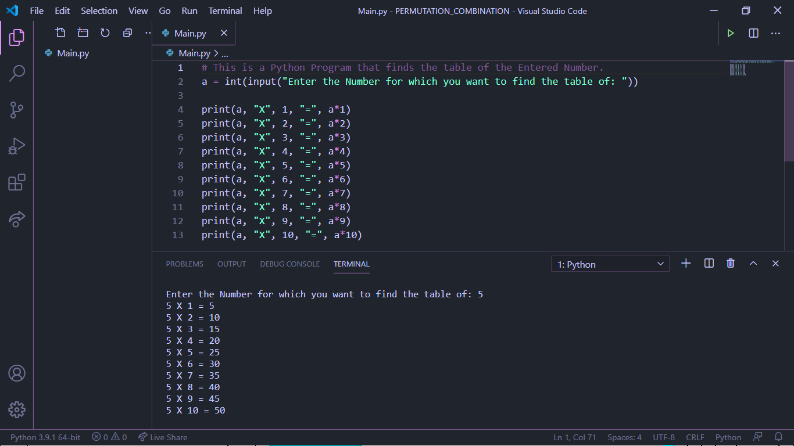

# Tables_Printer
This is a Python Program that prints tables of the Number Entered. You just need to run the Main.py and Enter the Number and it will provide you with table of Number Entered. Hope that you like my Project Below is my Code Screenshot:

